# artier

> An app that gives you the power to be an art critic - one swipe at a time.

## What's In This Document

- [General Info](#general-info)
- [Technologies](#technologies)

## General Info

artier is an app with tinder-like swiping to allow artists and art enthusiasts to connect.

Upon app load, users are brought to a login screen where they can also click a button to enter the registration flow.

  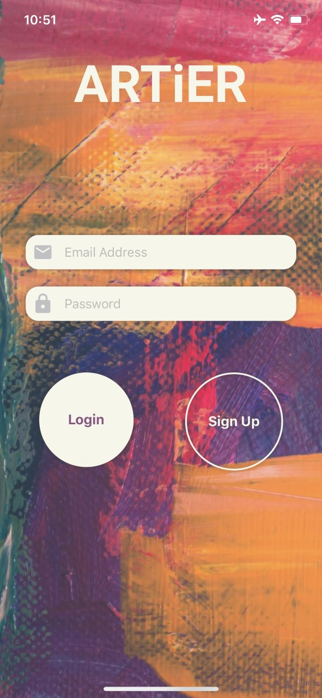 

  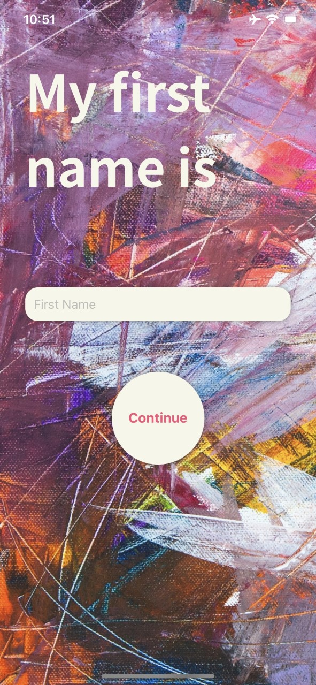
  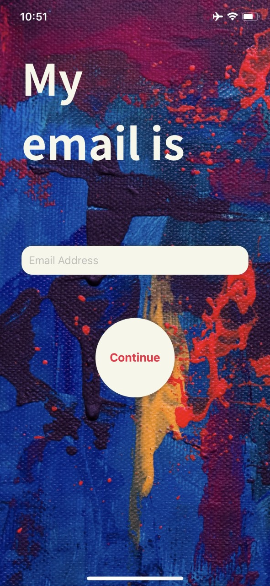
  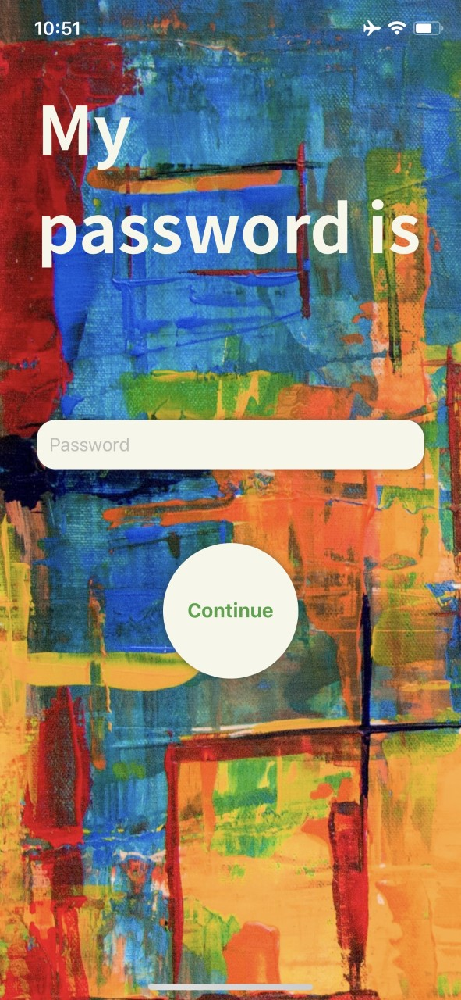
  

After registering for an account, the user is taken to the AddArtScreen modal to take/upload pictures of their artwork.

  <kbd>
    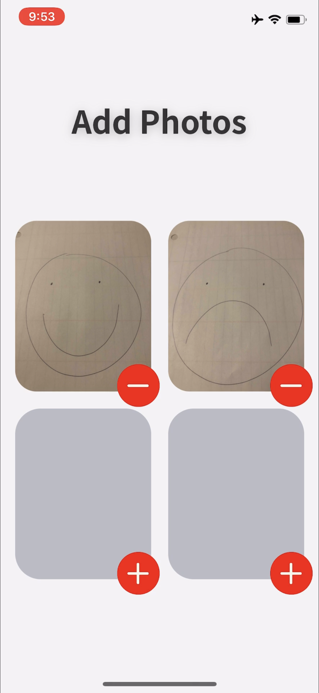
  </kbd>

Upon closing the AddArtScreen modal the user will be shown a quick tutorial of how the app works.

  <kbd>
    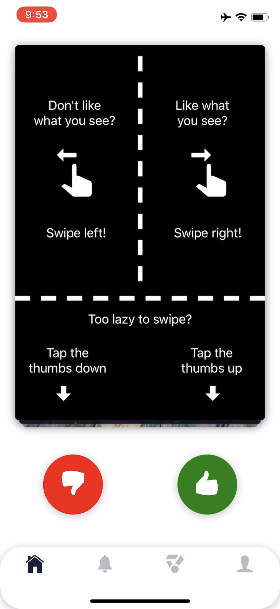
  </kbd>

Once the tutorial card fades away, the user will be able to see and swipe either left or right on all artwork uploaded by other users. Once the entire stack has been swiped through, the user will be shown an empty state to signify that there is no new art to see.

  <kbd>
    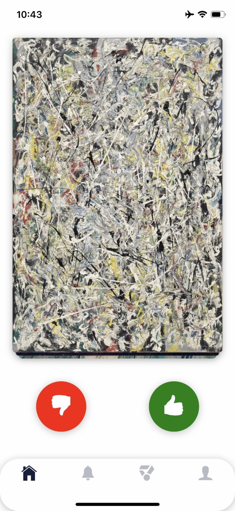
  </kbd>
  <kbd>
   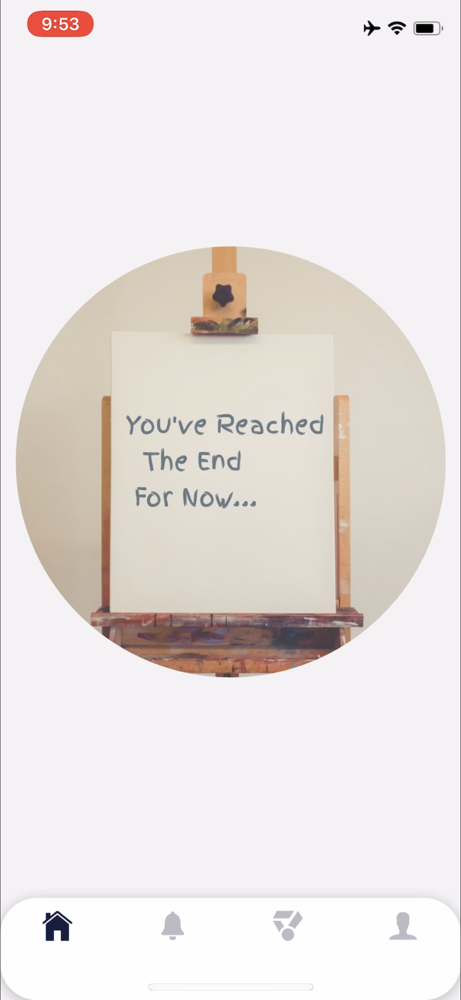
  </kbd>

Users can navigate to the notifications screen to see what new notifications they have. If there are no notifications, the user will be shown an empty state.

  <kbd>
    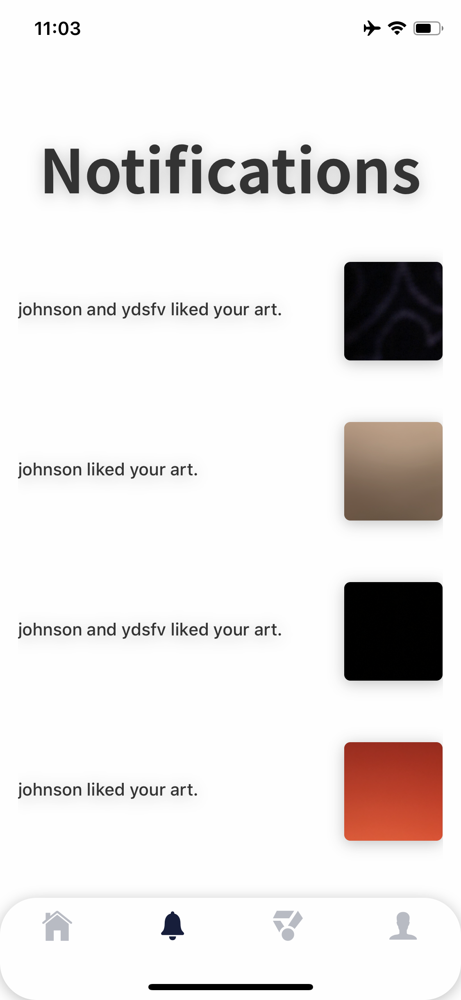
  </kbd>
  <kbd>
    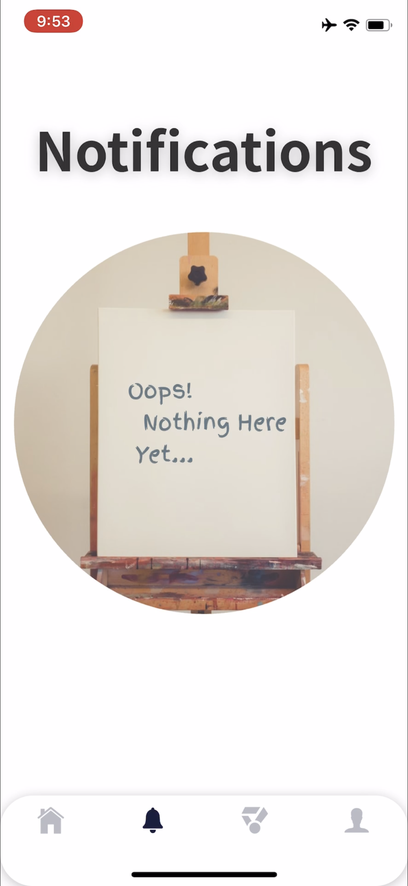
  </kbd>

Users can navigate to the masterpieces screen to see the most liked works of art.

  <kbd>
    
  </kbd>

Users can also navigate to the profile screen to see the cumulative amount of likes and dislikes each of their works of art currently has. The user can also click a button to open the AddArtScreen modal and upload their artwork or click the logout button to return to the LoginScreen.

  <kbd>
    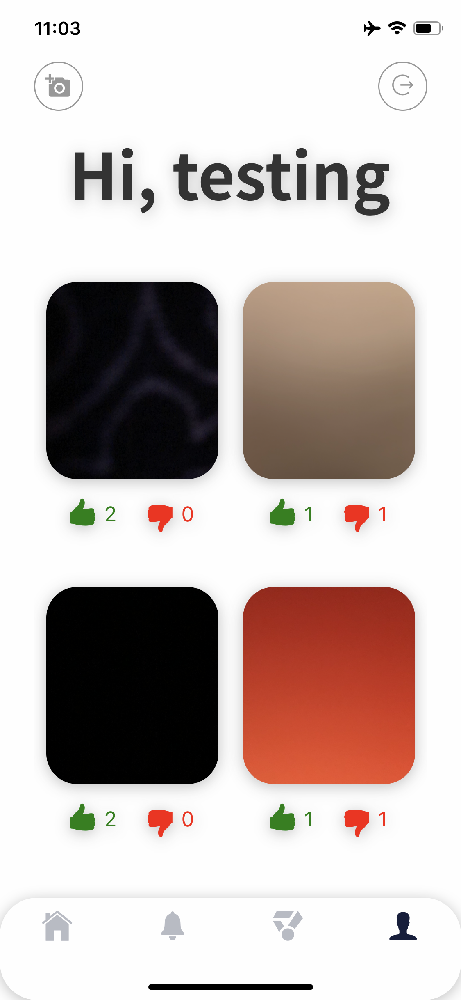
  </kbd>

## Technologies

App Track is created with:

* CSS
* React-Native
* Redux
* React-Redux Hooks
* Redux-Thunk
* Firebase
* React-Native-Deck-Swiper
* React-Navigation
* React-Navigation-Stack
* React-Navigation-Tabs
